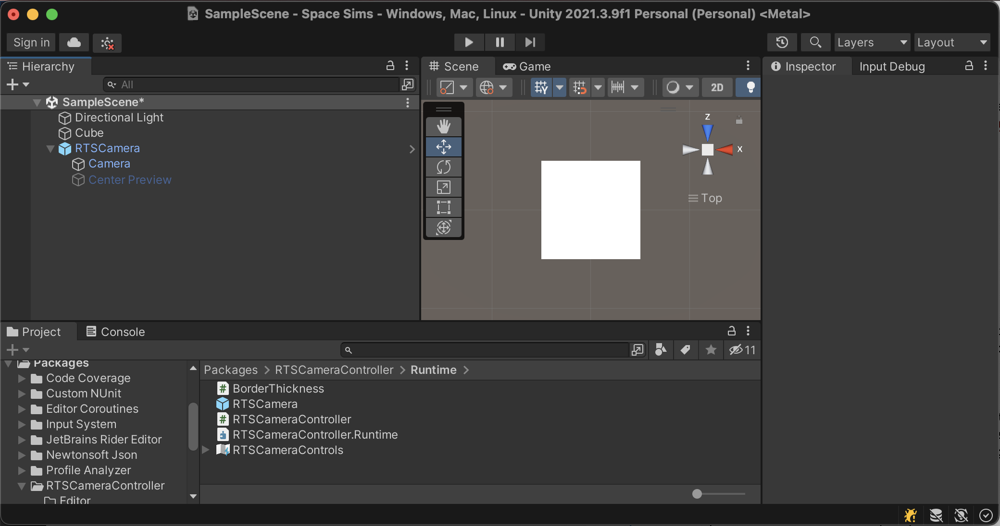
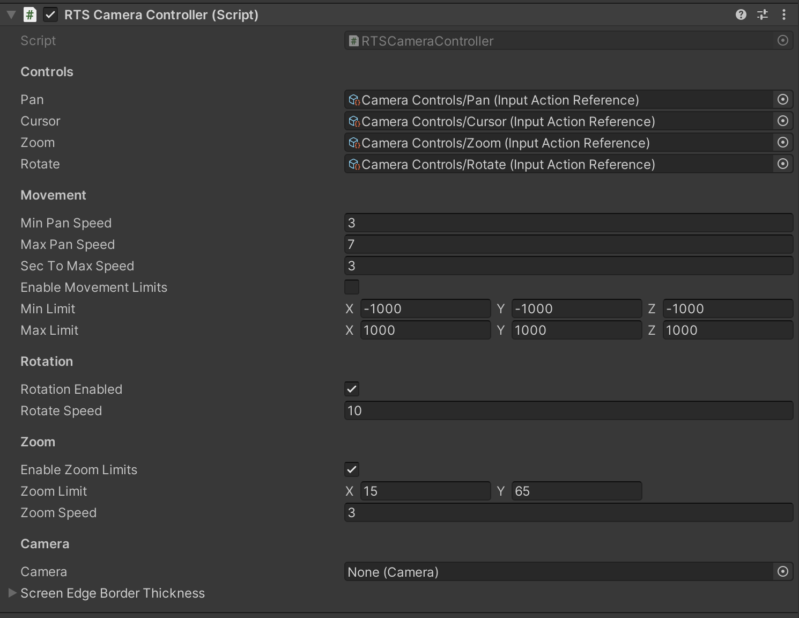

[](https://openupm.com/packages/uk.me.paraskos.oliver.rts-cameracontroller/)

# RTS Camera Controller

## Overview
Build for the "new" input system as a simple minimal-dependency drop-in camera controller to bootstrap Top down / RTS style games
Based on [https://github.com/PanMig/Unity-RTS-Camera/blob/master/Assets/Scripts/RTSCameraController.cs](work by github.com/PanMig)


## Package contents

      <root>
        ├── package.json
        ├── README.md
        ├── CHANGELOG.md
        ├── LICENSE
        ├── Runtime
        |   ├── RTSCamera.prefab // Simple drop in camera
        │   └── RTSCameraController.cs // Main Script
        └── Documentation~ // Images used in this documentation
        
## Installation instructions
```shell
 $ openupm add uk.me.paraskos.oliver.rts-cameracontroller
    notice manifest added uk.me.paraskos.oliver.rts-cameracontroller@1.0.0
    notice please open Unity project to apply changes
```

## Requirements
Tested against 2021.3.9f1 with InputSystem 1.4.4

## Workflows
After installing the package open unity and drag the RTSCamera prefab from the package into your scene



Select the object in the Heirarchy and tweak its settings


You can drag and drop input actions from your own controls into Pan, Cursor, Zoom, Rotate

Pan expects a Vector2 which indicates the direction to move the camera in
Cursor expects a Vector2 indicating mouse position on screen
Zoom and Rotate expect float inputs which adjust the camera zoom and rotation respectively.


The Camera property can be left null and it will use Camera.main.